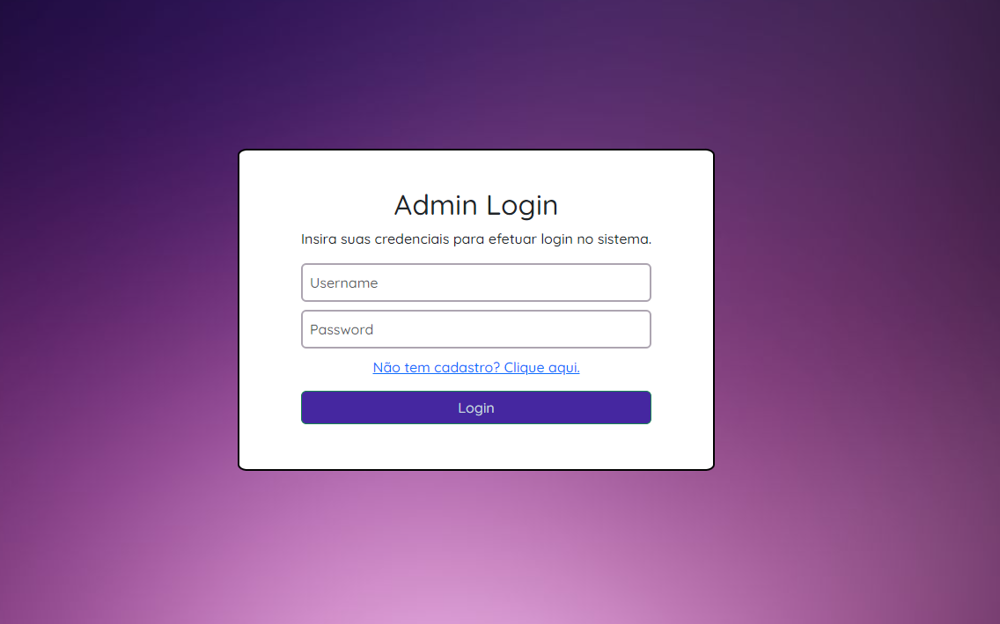
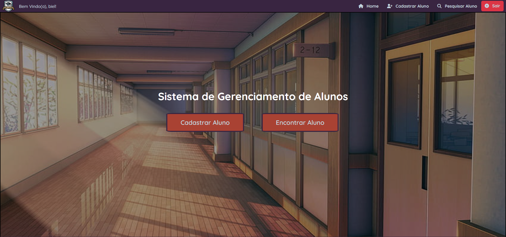
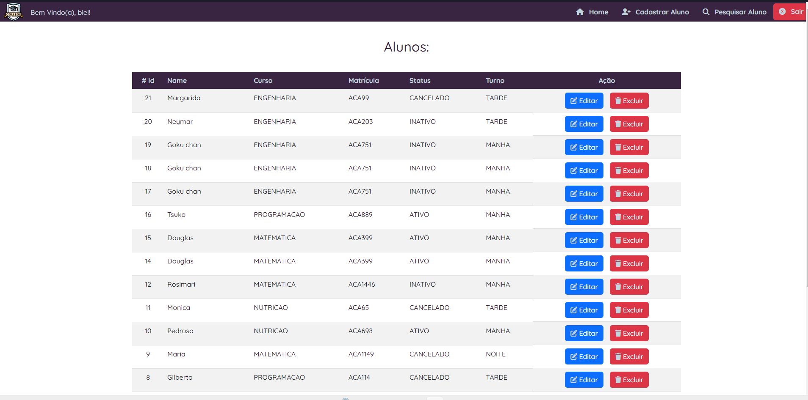
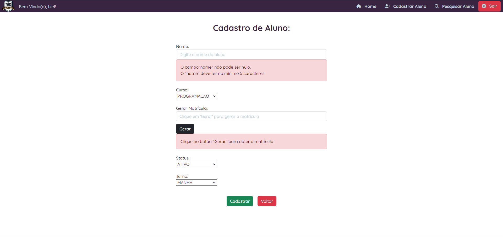

<h1> CRUD Operation using Spring Boot + Thymeleaf</h1>


<h2> Project 💻 </h2>

O objetivo desse projeto foi criar uma operação CRUD, utilizando Spring Boot + Thymeleaf.

Contextualizando, aqui temos uma aplicação de gerenciamente de "Alunos". O responsável/professor conseguirá, através dessa aplicação, manipular os registros desses "Alunos" no sistema, fazendo as operações:

- `CREATE`
- `READ`
- `UPDATE`
- `DELETE`


<br>

### Imagens da apicação:

#### Login Authentication



<br>

#### Home Page



<br>

#### Listagem de alunos



<br>

#### Validação dos dados inputados



<br>

Além das tecnologias citadas acima, foram utilizadas também outras tecnologias:


<hr>
<br>


<h2> Technologies 🌟 </h2>


- [Java](https://www.oracle.com/java/technologies/downloads/)
- [Maven](https://maven.apache.org/download.cgi)
- [Spring Boot](https://spring.io/projects/spring-boot)
- [Thymeleaf](https://www.thymeleaf.org/)
- [Spring Data JPA](https://spring.io/projects/spring-data-jpa)
- [Spring Security](https://docs.spring.io/spring-security/reference/index.html)
- [PostgreSQL](https://www.postgresql.org/download/)

<hr>
<br>


<h2> Configuration 🛠️ </h2>


<h3> 
    Dependencies
    
</h3>


Para que a aplicação funcione corretamente, é importante que ela possua as seguintes dependencies:


- Spring Data JPA
- Spring Devtools
- Spring Web
- PostgreSQL Driver
- Spring Boot Starter Security
- Thymeleaf
- Bean Validation


<br>


<h3> Aplication Properties ⚙️ </h3>

```properties
# Informamos o caminho do banco de dados
spring.datasource.url=jdbc:postgresql://localhost:5432/nomeDoBanco

# Usuário do banco de dados - São os usuários de dentro do banco de dados e NÃO do linux
spring.datasource.username=postgres

# Senha do banco de dados. É a senha do usuario de dentro do banco de dados
spring.datasource.password=123

# Acompanha as alterações feitas nas entidades. Qualquer alteração feita na entidade, a table também vai sofrer alteração.
spring.jpa.hibernate.ddl-auto=update

# Mostrar os commands SQL feitos pelo jpa
spring.jpa.show-sql=true
```


<hr>
<br>


<h2> Build and Run 🚀 </h2>

1. Clone o repositório para sua máquina:

    ```bash
    //clone o repositório para sua máquina
    git clone https://github.com/lGabrielDev/projetoThymeleafAlunos.git
    ```

2. Rode a aplicação e acesse a rota `http://localhost:8080/`

<hr>
<br>


